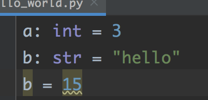

# Intro to Python

## Script vs Program

Python can be used a scripting language where each line is executed in order, with no
main function defined.

**All functions must be defined before they can be used.**

```python
# Invalid python
foo(3)
def foo(a):
    print (a)
```

```python
# Valid python
def foo(a):
    print(a)
foo(3)
```

This can be very annoying.  Without going in too much detail, you can sidestep this
issue by using the following template for all your python programs.

```python
def main():
    # your starting code here

if __name__ == "__main__":
    main()
```

Example:

```python
# Now the order of definition doesn't matter
def main():
    foo(3)
def foo(a):
    print(a)

if __name__ == "__main__":
    main()
```

### ▶️ Exercise 0.0 - Hello World

2. Open PyCharm and create a new project.
5. Name the project `Hello-World`:
3. Create a folder inside this project called `00`.

   - You may need to install the version of Python that you want.

4. Create a new file `hello_world.py` in your folder

```python
print ("hello world")
```
```python
def main():
    print("hello world")
if __name__ == "__main__":
    main()
```
Press the run button on the menu bar at the top of the window to run your code.

## Indentation

Python does not use squiggly braces (`{...}`) to define code blocks.  The code blocks are 
defined by their indentation.  How much the code is indented does not matter, as long as it is 
consistent.

```python
a = 3
b = 3
if a == b:
                print("hello")
                print("this is a valid indention")
if a - b == 0:
 print("hello")
 print("this is also valid indentation")
```

However, please keep all of your indentation the same size to make your code more readable :)

## Type Hinting
Python is a dynamically typed language!

What this means is that the `type` of a variable is determined by what is assigned to it.
```python
a = 3 # a is an integer
print(type(a))  
a = "hello" # now a is a string
print(type(a))
```

In spite of this, Python is still a type-safe language.
```python
a = "3"
b = 4
c = a + b  # TypeError: unsupported operand type(s) for +: 'int' and 'str'
```

**BUT**: this can cause a lot of confusion in more complicated programs, not knowing which variable is of what type.

Python includes the ability to specify what variable is of what type.  This is called `type hinting`.  It is called
`type hinting` because it does not prevent errors, but it gives *hints* to the IDE, which will notice if you make
a mistake.

```python
a: int = 3
b: str = "hello"
b = 15      # Not an error when run, but PyCharm will indicate that you made a mistake
```


**ALWAYS USE TYPE-HINTING!**

## Using Functions / Classes

`def `_name_of_function_`(`_arguments_`):`  NOTE THE COLON AT THE END OF THE LINE!

```python
def foo(b: int,c: int = 3):
    print(b*c)
    
def main():
    foo(1)         # c is optional, and will default to 3
    foo(1,5)       # c can be specified
    foo(c=10, b=1) # the order of parameters can be changed if you specify the name of the variables
                   # ... this is very nice if you have a long list of optional arguments
```

```python
from __future__ import annotations       # makes type hinting better

def main():
    b: Bar = Bar(3, 5)
    b.some_method(10)
    
class Bar:        # convention says that class names should be CamelCase
    def __init__(self, a: int, b: int):   # the constructor has already been called, 
                                          # ... this function initializes the object
        self.a = a 
        self.b = b
        self.ab = a*b
    
    def some_method(self, x: int):        # convention says methods should be snake_case
        print(x * self.ab)

```
Note that in python, the `self` variable must is explicitly stated in the function definition.
`self` is equivalent to the `this` in `C#`.

These two calls are identical!:
```python
b: Bar = Bar(3,5)

some_method(b,10)
b.some_method(10)
```


## Interfaces / Protocols

An **interface** in object-oriented programming is a set of variables and functions that a class must implement.

- 🦴 "Skeleton" aspect: the implementing class "fills out" the structure of the interface.
- 📑 "Contract" aspect: the implementing class must implement each of the method signatures defined in the interface declaration.
- 🔌 "Membership" aspect: the implementing class can be supplied wherever the interface type is used, i.e.: where code is written in terms of the interface.

Here's an excellent example of interfaces by [Dave Leeds](https://www.hitthebits.com/p/about-me.html):

[](https://www.hitthebits.com/2012/11/what-are-interfaces.html)

The light switch provides an easy way for the caller to turn the lights on without the caller having to know anything about the fancy electrical stuff! This concept goes hand in hand with the OOP concept of [abstraction](https://www.digitalocean.com/community/tutorials/what-is-abstraction-in-oops).

In Python, interfaces can be implemented via `abstract classes` or `Protocol`s.  In this course
we will be using `Protocol`s to implement an interface.

Python uses [duck typing](https://www.geeksforgeeks.org/duck-typing-in-python/).  “If it looks like a duck and quacks like a duck, it’s a duck”

Duck typing is implemented by dynamic languages. Some static languages like Haskell also supports it. But, Java/C# doesn’t have this ability yet.

Example:
```python
from typing import Protocol

# this is our interface
class FooInterface(Protocol):
    def print_hi(self): pass
    def capitalize(self) -> str: pass

# define a class that implements this protocol
# it can implement more functions than is required.
class Foo:
    def __init__(self, name: str):
        self.name: str = name

    def print_hi(self):
        print(f"Hi {self.name}")

    def capitalize(self) -> str:
        return self.name.capitalize()

class Bar:
    def __init__(self, foo: FooInterface):
        self.foo = foo

    def some_method(self):
        self.foo.print_hi()

def main():
    sandy: Foo = Foo("sandy")
    b = Bar(sandy)              # this is ok, because Foo has the same method signatures
                                # as the Protocol (looks like a duck)
    b.some_method()


if __name__ == '__main__':
    main()
```

## ▶️ Exercise 0.1 - Survey

Please click [here](https://github.com/JAC-CS-Programming-4-W23/E0.1-Survey) to do the exercise and remember to post your survey results to Moodle!

# Copyright Notice

All notes in this package are copyrighted under the Creative Commons License CC BY-NC

This license enables reusers to distribute, remix, adapt, and build upon 
the material in any medium or format for noncommercial purposes only, and only 
so long as attribution is given to the creator. 

CC BY-NC includes the following elements:

 BY: credit must be given to the creator.
 NC: Only noncommercial uses of the work are permitted.

Notes originated from Ian Clement, and modified by Vikram Singh.  
They have been subsequently modified by Ian Clement and Sandy Bultena.

All rights reserved (c) 2024
