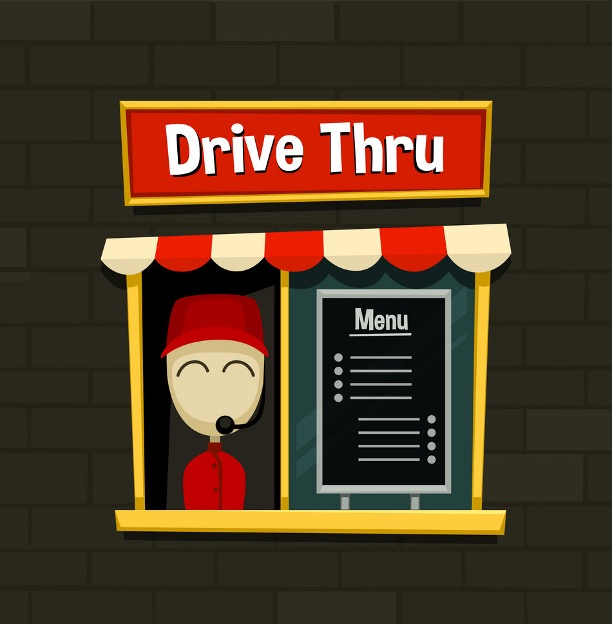
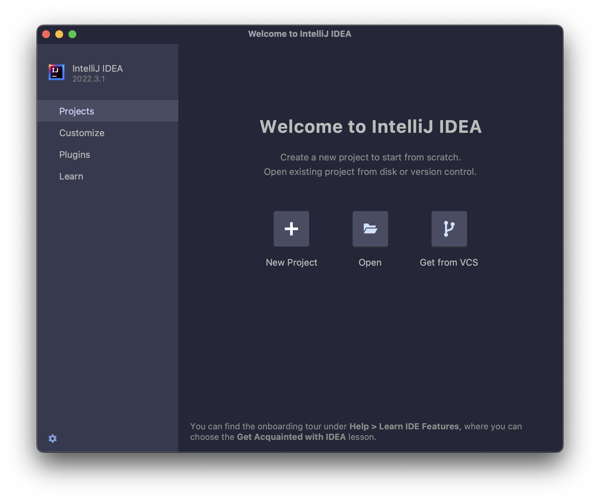
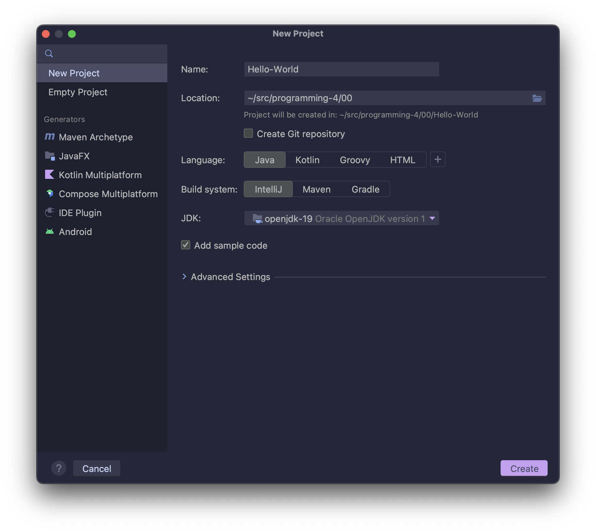
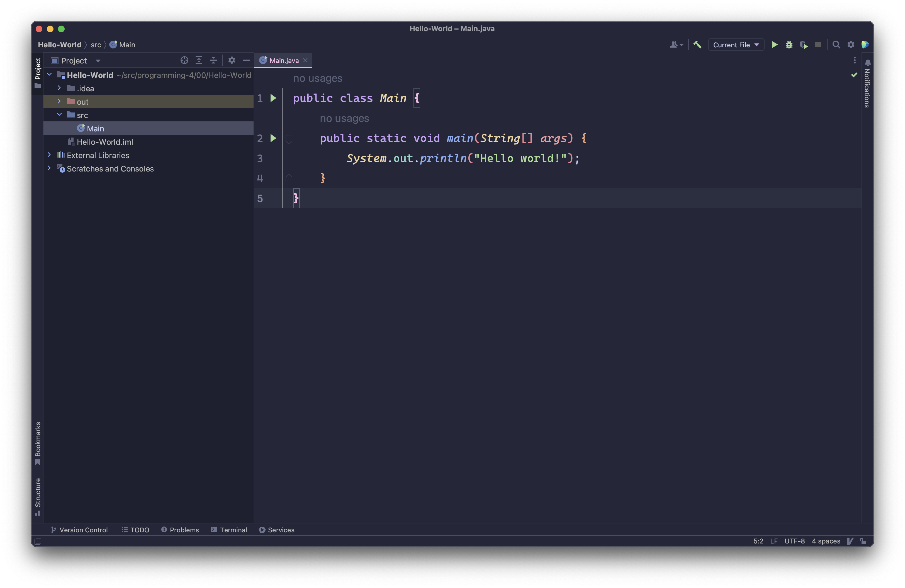
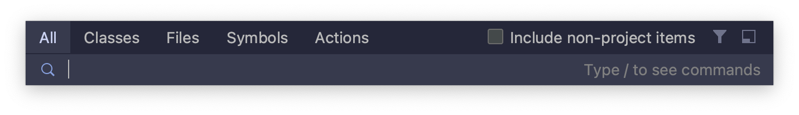
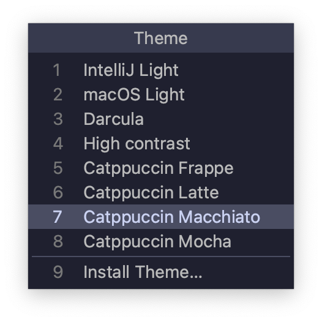
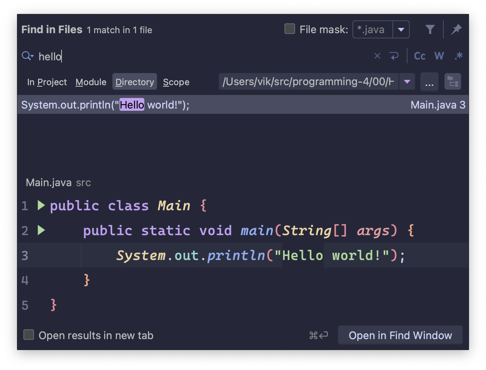
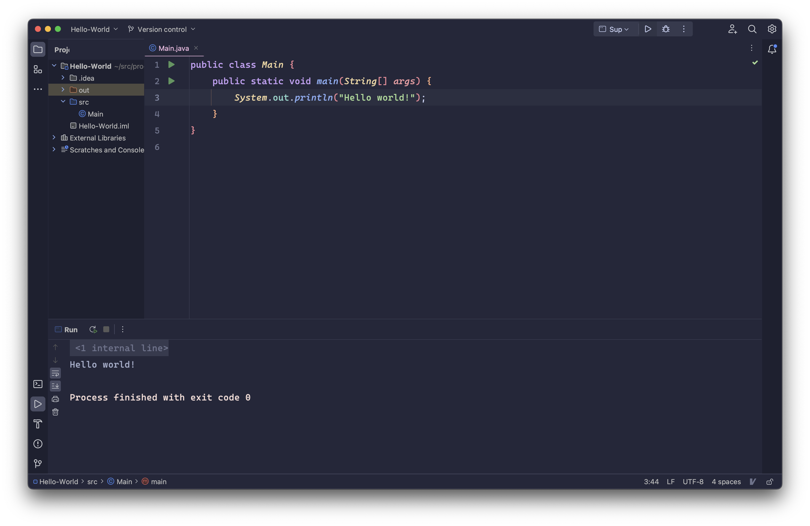
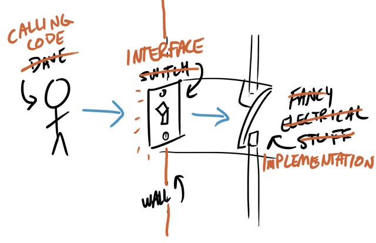

# 🌱 Getting Started

## 🎯 Objectives

1. **Explain** what is a data structure and an algorithm.
2. **Install and set up** a basic Java project using the IntelliJ IDE.
3. **Print** "Hello World" to the console.
4. **Review** basic OOP concepts.

## ☕ Introduction to Java

- Created in the 1990’s
- OOP language
- Very popular in 2000’s [still very popular](https://www.tiobe.com/tiobe-index/)
  – Sometime check out: [The Most Popular Programming Languages - 1965/2020](https://www.youtube.com/watch?v=UNSoPa-XQN0)
- Evolving: Current language version is 19. If interested have a look at [this guide to Java versions and features](https://www.marcobehler.com/guides/a-guide-to-java-versions-and-features).
- Mobile (Android) Web (server side) Enterprise
- Big data
- "write once, run anywhere"
  - compiled Java is "bytecode" (.class files)
  - You can "read" bytecode but the real version is in binary
  - bytecode runs on a Java Virtual Machine available on many platforms, including Android
- **JVM** Java Virtual Machine, used to run java code by reading bytecode and running instructions on the machine.
- **JRE** Java Runtime Environment. Software to run compiled Java, including libraries and JVM.
- **JDK** Java Development Kit. Tools to compile and run java programs, includes a JRE and JVM.
- [JDK vs JRE vs JVM in Java](https://www.guru99.com/difference-between-jdk-jre-jvm.html)
- Java SE Java Standard Edition (we will use this)
- Java EE Java Enterprise Edition
- JDK per Java version
- Multiple companies have JDKs: Oracle, Google (Android), Amazon

## 🚘 Data Structures & Algorithms

[](https://cdn3.vectorstock.com/i/1000x1000/25/07/cartoon-drive-thru-menu-board-fast-food-business-vector-17482507.jpg)

- **Data structure**: A way to represent and model a collection of _values_ that are subject to a set of _rules_.
  - **Values**: All the people in their cars at a fast food drive-thru
  - **Rules**: The first customer that ordered gets their food first, new customers have to start at the back of the line
- **Algorithm**: A _sequence_ of operations to complete a _task_.
  - **Task**: Ordering food at a fast food represent
  - **Sequence**:
    1. Give your order to the employee at the cash register
    2. Pay for your order
    3. Wait for your order to be prepared
    4. Receive your order

Before we can start learning about and implementing our first data structure and algorithm, we should first set up our IDE.

## 🍎 Mac Tips

Since we'll be working in the Mac lab this semester, it's important to know a few things about Macs specifically:

### Key Shortcuts

- Many shortcuts are the same as Windows if you swap `CTRL` for `CMD`. For example, `CTRL + C` on Windows is `CMD + C` on Mac.
- `CMD + SPACE` brings up the spotlight search. You can type anything after this and it will search for it on the computer. It's my preferred method for opening applications.
- `CMD + TAB` swaps between applications, similar to `ALT + TAB` on Windows.
- ``` CMD + ` ``` swaps between windows of the same application. For example, if you have multiple Word documents open, you can swap between them with this shortcut.

### Behaviour

- Maximizing windows does not work like you're probably used to. If you click the green maximize button on a window, it will make that application full screen. Full screen can be useful at time, but what you probably want instead is to simply **double click the titlebar of the window** which will make it take up the entire height and width of the monitor, similar to Windows.
- If you're like me and prefer pages to scroll **down** when you scroll **down** (as opposed to scrolling **down** when you scroll **up**), then bring up the spotlight search (`CMD + SPACE`), search and select "mouse", and uncheck "natural scrolling".
  - Yes, this means that in the eyes of Tim Apple, we are _unnatural_. 😔

### Screenshots

- You can take and store a **screenshot** to your clipboard with `CMD + CTRL + SHIFT + 4`. You can then paste (`CMD + V`) the screenshot into an email, Teams message, etc.
- If you need the actual image file of the screenshot, `CMD + SHIFT + 4` will save the image to your Desktop.
- If you want to take a screenshot of an entire window, add `SPACE` to any of the above commands.

## 🔨 Setup

1. Download and install [IntelliJ Community Edition](https://www.jetbrains.com/idea/download) for your OS if it's not already installed.
2. Decide where you want your in-class exercises to live for this semester. I recommend creating a folder at `~/src/programming-4`.
   - Bonus points if you make this a Git repo and manage it with GitHub!
3. Create a folder inside this folder called `00`.
4. Open IntelliJ and click "New Project":

   

5. Name the project `Hello-World`:

   - You may have to download the JDK if it's not already downloaded on your computer.

   

   - This should be as simple as clicking the JDK dropdown menu, selecting "Download", and choosing `openjdk-19`.

6. Hit "Create", and if everything went well, you should see your new Hello World project!

   

### Search Everywhere

Most modern IDEs have a universal search function similar to the Mac's search (`CMD + SPACE`) or Window's search (`WIN`). For IntelliJ, this search can be brought up with double `SHIFT`:



Let's use it to change themes!

1. Bring up search with double `SHIFT`, type "theme", and hit `ENTER`:

   [](https://plugins.jetbrains.com/plugin/18682-catppuccin-theme)

2. You can choose a theme that's already installed, or click "Install theme..." to install another one. I'm a big proponent of customized workspaces! ✨
3. If `Main.java` is currently open, close the tab either by clicking the "x" on the tab itself or (my preferred way) use the shortcut `CMD + W`.
4. Bring up search with double `SHIFT`, type "Main", and you should see the first hit is our `Main.java` file.
5. Hit `ENTER` and it should open the file.
6. Close the tab again, and this time bring up the "find in files" function with `CMD + SHIFT + F`.
7. Type "hello" and you should see the `Main::main()` function pop up:

   

8. Hit `ENTER` and it should open the file.

These are two super powerful features that you should get familiar with in any IDE. From here, you can open any file in your project and invoke any IDE function you may need!

### ✨ New IntelliJ UI

Being a web guy, I must admit that I have an affinity for Visual Studio Code. When I saw that IntelliJ had a new experimental UI, I had to check it out, because it makes IntelliJ look more like VSC! 🤩


If you're curious, you can enable this too. You can always change it back if it's not your thing. To enable it, hit double `SHIFT` and search for "New UI".

## ▶️ Exercise 0.0 - Hello World

There's not much we actually have to do since "Hello world!" is already written for us:

1. Hit the green "play" icon on the top right and you should see "Hello world!" printed in the console.



That was easy!

### Review

Even though you may not have seen Java code before, you'll probably notice many similarities to C#.

```java
public class Main {
    public static void main(String[] args) {
        System.out.println("Hello world!");
    }
}
```

1. `public`: An _access modifier_ that allows the member (i.e. class, method, or variable) to be seen by all other members. Other access modifiers include _private_ and _protected_.
2. `class`: A blueprint which describes the data and functionality of a particular object or entity you're trying to model.
3. `static`: The method can be invoked without having to make an instance of the class.
4. `void`: The return type of the method.
5. `String[] args`: When starting the program from the terminal, one may optionally pass in arguments to be used in the execution of the code.

   ```java
   public class Main {
       public static void main(String[] args) {
           System.out.println(args[0]);
       }
   }
   ```

    ```text
    > java Main
    Exception in thread "main" java.lang.ArrayIndexOutOfBoundsException: Index 0 out of bounds for length 0
        at Main.main(Main.java:3)

    > java Main programming 4 is awesome
    programming
    ```

6. `System.out.println()`: When you want to write to [standard out](https://docs.oracle.com/en/java/javase/19/docs/api/java.base/java/lang/System.html#out).

### Interfaces

An **interface** in object-oriented programming is a set of variables and functions that a class must implement.

- 🦴 "Skeleton" aspect: the implementing class "fills out" the structure of the interface.
- 📑 "Contract" aspect: the implementing class must implement each of the method signatures defined in the interface declaration.
- 🔌 "Membership" aspect: the implementing class can be supplied wherever the interface type is used, i.e.: where code is written in terms of the interface.

Here's an excellent example of interfaces by [Dave Leeds](https://www.hitthebits.com/p/about-me.html):

[](https://www.hitthebits.com/2012/11/what-are-interfaces.html)

The light switch provides an easy way for the caller to turn the lights on without the caller having to know anything about the fancy electrical stuff! This concept goes hand in hand with the OOP concept of [abstraction](https://www.digitalocean.com/community/tutorials/what-is-abstraction-in-oops).

## ▶️ Exercise 0.1 - Survey

Please click [here](https://github.com/JAC-CS-Programming-4-W23/E0.1-Survey) to do the exercise and remember to post your survey results to Moodle!

## 📚 References

- [Official Java API Docs](https://docs.oracle.com/en/java/javase/19/docs/api/index.html)
- [What are Interfaces in Object-Oriented Programming (OOP)?](https://www.hitthebits.com/2012/11/what-are-interfaces.html)
- [What is Abstraction in OOPS?](https://www.digitalocean.com/community/tutorials/what-is-abstraction-in-oops)
