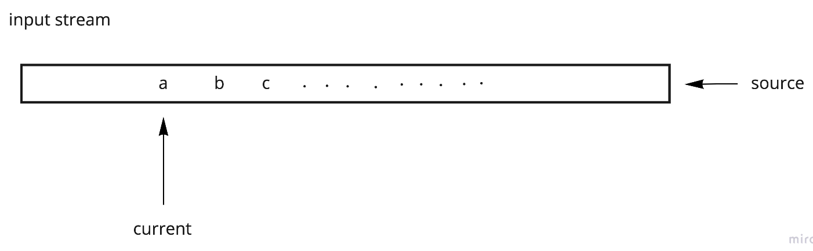
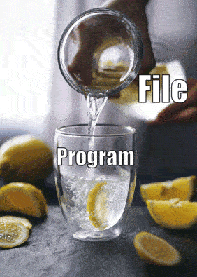
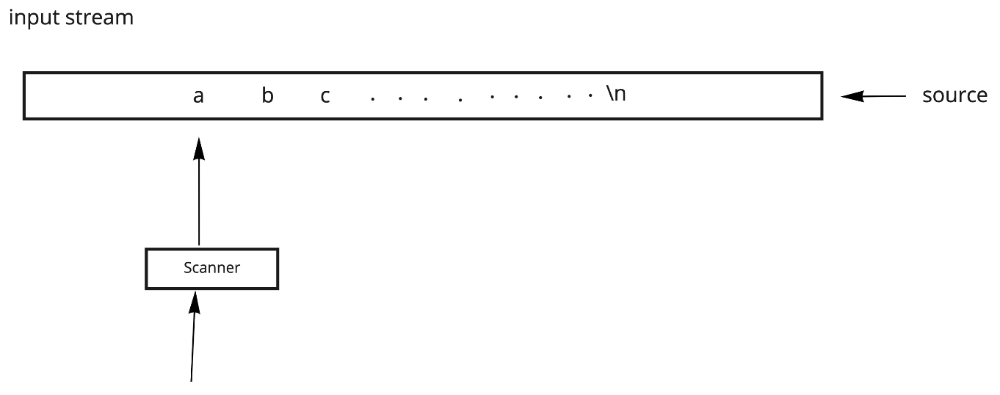
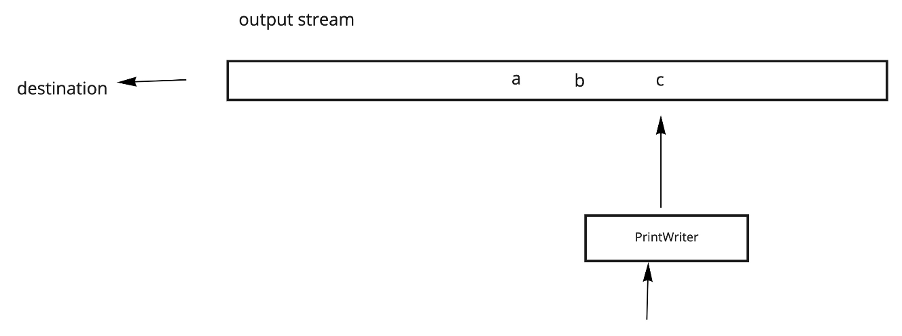

# 🌊 Input/Output Streams

## 🎯 Objectives

- **Explain** what is a stream of data.
- **Read** input from the user or a file.
- **Write** output to the console or a file.

## 📖 Reading & Writing

Computers are so [blazingly fast™️](https://i.redd.it/t7ns9qtb5gh81.jpg) these days that reading and writing data can seem instantaneous. You may have come accross the term "data stream" in your Computer Science journey. A file, for example, cannot instantly go from one place to another. Rather, it needs to be split up into chunks so that the chunks can easily flow down the **stream** from point A to point B.

[](https://dribbble.com/shots/5690316-The-lazy-girl-on-the-lazy-river)

Think of **streaming** services like YouTube, Netflix, Twitch, etc. When you watch content on these sites, do you actually wait for the whole video to download to your computer before you can watch it? No, that would take forever! Instead, the video data is sent in chunks to your computer where you view the current moment of the video, and then the chunk is gone moments later.

[](https://today.umd.edu/content-still-king-streaming-wars-985f2fbc-6c5b-4982-a467-06b000f52f94)

- Java has libraries that work like `StreamReader`, `StreamWriter` in C#.
- **Input stream**: data "generated" by a source, like a file or console user, arrives into the program by a `read()` method.

   

- **Output stream**: data generated by our program is sent to a destination, like a file or the console. This is done with a `write()` method.
- We usually only move one direction in a data stream, i.e. forward. It's rare, but in some streams, we are allowed move around in the stream. Usually, stream algorithms are written to disallow this behaviour.

[](https://loopedgifs.tumblr.com/image/151582354375)

### File Reader

Java's `FileReader::read()` method reads a single `char` from the stream and advances:

```java
FileReader reader = new FileReader("in.txt");
char c = (char)reader.read();
```

### File Writer

Java's `FileWriter::write()` method writes a single `char` to the stream.

```java
FileWriter writer = new FileWriter("out.txt");
writer.write('a');
```

## 🐑 Copy a File

### Copy v1: The Basic Way

Read all characters from an input file to an output file, i.e.: file copy.

```java
public static void copy(String inFileName, String outFileName) {
    FileReader reader = new FileReader(inFileName);
    FileWriter writer = new FileWriter(outFileName);
    int c = reader.read();

    while(c != -1) {
        writer.write(c);
        c = reader.read();
    }

    reader.close();
    writer.close();
}
```

### Copy v2: The More Efficient Way

We will revisit combining streams later in the course!

```java
public static void copy(String inFileName, String outFileName) {
    BufferedReader reader = new BufferedReader(new FileReader(inFileName), 1024);
    BufferedWriter writer = new BufferedWriter(new FileWriter(outFileName), 1024);
    int c = reader.read();

    while(c != -1) {
        writer.write(c);
        c = reader.read();
    }

    reader.close();
    writer.close();
}
```

According to [the Java docs](https://docs.oracle.com/javase/7/docs/api/java/io/BufferedReader.html), the above is more efficient because:

> [`BufferedReader`] will buffer the input from the specified file. Without buffering, each invocation of `read()` or `readLine()` could cause bytes to be read from the file, converted into characters, and then returned, which can be very inefficient.

### Copy v3: The Scanner and PrintWriter Way

To read more than just single characters, we can attach a [_scanner_](https://docs.oracle.com/javase/7/docs/api/java/util/Scanner.html) to an input stream:



- The `Scanner` class has two major kinds of methods: `hasNext()` and `next()`.

To write more than just single characters, we can attach a [_print writer_](https://docs.oracle.com/javase/7/docs/api/java/io/PrintWriter.html) to an output stream:



- The `PrintWriter` class has many overloads to `print()` and `println()`. Above copy example, but now line by line:

```java
public static void copy(String inFileName, String outFileName) {
    Scanner scanner = new Scanner(new FileReader(inFileName));
    PrintWriter writer = new PrintWriter(new FileWriter(outFileName));

    while(scanner.hasNextLine()) {
        writer.println(scanner.nextLine());
    }

    scanner.close(); // Closes the file reader.
    writer.close();
}
```

### Scanner Functions

Consider a text file (or any stream) with numbers and words:

```text
-1 123
abc
3.1415
223372036854775807

----------------------------------------
|-1 123\nabc\n3.1415\n223372036854775807|
----------------------------------------
```

```java
FileReader reader = new FileReader("input.txt");
Scanner scanner = new Scanner(reader);

int x = scanner.nextInt();       // -1
int y = scanner.nextInt();       // 123
String s = scanner.next();       // "abc"
double d = scanner.nextDouble(); // 3.1415
long l = scanner.nextLong();     // 223372036854775807

scanner.close();
```

What happens when the "cursor" sees one thing and we expect another?

We can interpret the content of the file as Java primitives. Ex: summing a file of integers:

```java
public static int sum(String inFileName) {
    Scanner scanner = new Scanner(new FileReader(inFileName));
    int sum = 0;

    while(scanner.hasNextInt()) {
        sum += scanner.nextInt();
    }

    // At this point, we're confident that the next chunk of data is not a int.

    if (scanner.hasNext()) {
        // If we're here, there's still stuff to be read, but it's not a int.
        throw new RuntimeException("Bad input, I need a file that only has ints!");
    }

    scanner.close(); // Closes the file reader.

    return sum;
}
```

`Scanner` reads input by tokens delimited by whitespace by default (regex: `[ \n\t]+`), so the above works for input like this:

```text
736   284
32 409          5432
```

We can use `Scanner` to count the lines and words in a given file:

```java
public static void countLinesAndWords(String inFileName) {
    Scanner scanner = new Scanner(new FileReader(inFileName));
    int lines = 0;
    int words = 0;

    while (scanner.hasNextLine()) {
        lines++;

        while (scanner.hasNext()) {
            words++;
        }
    }

    scanner.close(); // Closes the file reader.

    System.out.printf("%d lines and %d words.", lines, words);
}
```

## ✂️ Exercise 1.1 - Cut

Please click [here](https://github.com/JAC-CS-Programming-4-W23/E1.1-Cut) to do the exercise.

## 📚 References

- [BufferedReader](https://docs.oracle.com/javase/7/docs/api/java/io/BufferedReader.html)
- [Scanner](https://docs.oracle.com/javase/7/docs/api/java/util/Scanner.html)
- [PrintWriter](https://docs.oracle.com/javase/7/docs/api/java/io/PrintWriter.html)
