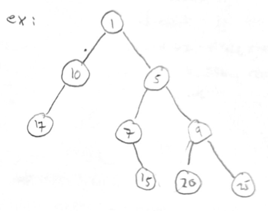

# 🌳 Trees

Common structure in Computer Science. Called tress because of their resemblance to actual trees!

In a filesystem, folders/directories store other folders and files, making a "tree" structure:


Other trees we've seen include: nested formats like HTML, XML and JSON, OOP inheritance, DFS/BFS search, etc.

## ✏️ Terminology


- A node is an element in the tree.
- A node can have children connected by lines/edges.
- A node can only have a single parent.

A tree is made up of nodes:


### Family Tree Style Terms

- The child nodes of c are {f, g, h}.
- The parent node of j is d.
- q has no children.
- a has no parent.
- The descendants of care {f, g, h, k, l}.
- The ancestors of e are {b, a}, i.e.: just parent, parent of parent and so on.
- The descendants of a are {b, c, d, e, ..., q}.
- The ancestors of q are {m, i, d, b, a}.
- The siblings of f are {g, h}.
- q has no descendants.

### Nature Style Terms

- The leaf nodes are {o, p, q, k, l, e, f, j}.
- The root node is a.
- The internal nodes are {m, i, d, b, c, g, h, a}, non-leaves, so we include the root.
- The path from e to a: [e, b, a].
- The path from q to a: [q, m, i, d, b, a].
- The path from a to o: [a, b, d, i, m, o].
- We will exclude paths to non-ancestors and non-descendants.

## 🌳 Binary Trees

All nodes have 0, 1, or 2 children.


- Leaf (no children)
- Left child
- Right child



- Which is the root?
- Which are the leaves?
- Which are the internal nodes?

### Code Representation


```java
public class Node<T> {
    public T element;
    public Node<T> left;
    public Node<T> right;
}
```

Here's a full memory drawing of a binary tree, but usually, we don't go into this much detail.


?> Note that `root == null` denotes an empty tree.

### Subtrees

Each node can be thought of as having two (possibly empty) subtrees:


We will use this recursive structure to write recursive methods.

## ▶️ Exercise 10.2 - Binary Tree Recursion

Please click [here](https://github.com/JAC-CS-Programming-4-W23/E11.1-Binary-Tree-Recursion) to do the exercise.

### Count Tree Nodes

Write a method that counts the number of nodes in a tree.

```java
public int size(Node<T> root) {
    if (root == null) {
        return 0;
    }

    int count = 1;

    count += size(root.left);
    count += size(root.right);

    return count;
}
```

or

```java
public int size(Node<T> root) {
    if (root == null) {
        return 0;
    }

    return size(root.left) + size(root.right) + 1;
}
```

In either implementation, the recursive calls approach the base case since we step closer to the leaves each time.

!> You might be tempted to have the base case be checking for a leaf node `if (root.left == null && root.right == null) return 1;`, however, we still need to have a base case that checks `root == null` for empty tree and also for nodes with only one child;

#### Trace of Size


### Count Tree Leaves

Write a method that counts the number of leaves in a tree.

```java
public int leafCount(Node<T> root) {
    if (root == null) {
        return 0;
    }

    if (root.left == null && root.right == null) {
        return 1;
    }

    return leafCount(root.left) + leafCount(root.right);
}
```

### Count Tree Height


```java
public int height(Node<T> root) {
    if (root == null) {
        return 0;
    }

    int h1 = height(root.left);
    int h2 = height(root.right);

    if (h1 > h2) {
        return h1 + 1;
    }
    else {
        return h2 + 1;
    }
}
```

or

```java
public int height(Node<T> root) {
    if (root == null) {
        return 0;
    }

    return Math.max(height(root.left), height(root.right)) + 1;
}
```


## 🔍 Binary Search Tree (BST)

A Binary Search Tree is a binary tree where each node satisfies the binary search tree property:


i.e. the left subtree of a given node contains values that are strictly less than the node's value, and the right subtree contains values that are strictly greater than the node's value.

## ▶️ Exercise 10.2 - Binary Search Tree

Please click [here](https://github.com/JAC-CS-Programming-4-W23/E11.2-Binary-Search-Tree) to do the exercise.
