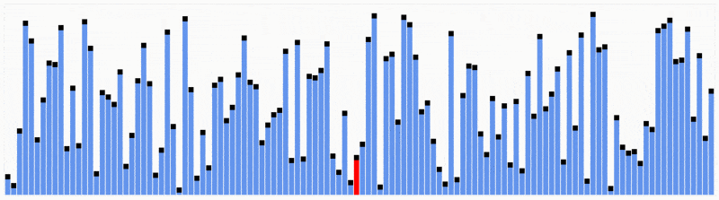

# ⚖️ Comparable

## 🎯 Objectives

- **Explain** Java's `Comparable` interface.
- **Explain** what a generic data type is in Java.
- **Implement** Java's `Comparable` interface to compare non-primitive data types using generics.
- **Sort** a collection of `Comparable` objects.
- **Trace** the binary search algorithm.
- **Find** a particular object in collection of `Comparable` objects using binary search.

## 🔢 The Natural Order

While having different meanings in [philosophy](https://en.wikipedia.org/wiki/Natural_order_(philosophy)) and [biology](https://en.wikipedia.org/wiki/Ordo_naturalis), the "natural order" of things in computer science usually refers to the way strings and numbers are ordered in a list.

[](https://medium.com/@aubreysinden/compare-and-contrast-bridge-lightroom-3a4adb038f15)

This should make sense when it comes to strings and numbers, but how do you order a list of objects? What's the criteria that makes one object greater/less than another object of the same type?

## ⚖️ The Comparable Interface

From [the Java docs](https://docs.oracle.com/javase/8/docs/api/java/lang/Comparable.html):

> [The Comparable] interface imposes a total ordering on the objects of each class that implements it. This ordering is referred to as the class's *natural ordering*, and the class's `compareTo` method is referred to as its *natural comparison method*.

If our class implements the `Comparable` interface, we must then override the `compareTo()` method.

```java
public interface Comparable<T> {
    int compareTo(T rhs);
}
```

- `<T>` is referred to as a *generic type*.
  - If you're unfamiliar with generic types, [here's](https://docs.oracle.com/javase/tutorial/java/generics/types.html) an excellent tutorial straight from the Java docs!
- `rhs` is an abbreviation for "right-hand side".
  - When we compare two things, we usually write something like `x < y`, where `x` is the expression on the "left" (`lhs`) and `y` is the expression on the "right" (`rhs`).
  - The object we call `compareTo()` on would then implicitly be the expression on the "left" and the one that we pass in would be the expression on the "right".
- `int` is the return type which should be a **negative integer, zero, or a positive integer** if `lhs` (this object) is **less than, equal to, or greater than** `rhs` (the object passed in).

### Example: Months

Java has a built-in [`Month`](https://docs.oracle.com/javase/8/docs/api/java/time/Month.html) enum that implements, you guessed it, the `Comparable` interface.

```java
ArrayList<Month> months = new ArrayList<>();

months.add(Month.APRIL);
months.add(Month.JANUARY);
months.add(Month.MARCH);
months.add(Month.FEBRUARY);

System.out.println(months); // [APRIL, JANUARY, MARCH, FEBRUARY]

System.out.println(Month.JANUARY.compareTo(Month.FEBRUARY)); // -1
System.out.println(Month.JANUARY.compareTo(Month.JANUARY)); // 0
System.out.println(Month.FEBRUARY.compareTo(Month.JANUARY)); // 1

Collections.sort(months);

System.out.println(months); // [JANUARY, FEBRUARY, MARCH, APRIL]
```

## ▶️ Exercise 2.1 - Comparable

Please click [here](https://github.com/JAC-CS-Programming-4-W23/E2.1-Comparable) to do the exercise.

## 🔍 Sorting & Searching

If you're thinking, "well, that's cool and everything, but when/why would I need to use Comparable?", then here's the answer from [the Java docs](https://docs.oracle.com/javase/8/docs/api/java/lang/Comparable.html):

> Lists (and arrays) of objects that implement [`Comparable`] can be sorted automatically by `Collections.sort` (and `Arrays.sort`).

[](https://lamfo-unb.github.io/2019/04/21/Sorting-algorithms/)

The answer is: **free sorting**! If you keep a sorted collection of objects, then you can use the built-in Java sort methods, as long as the objects in the collection implement `Comparable`! 🥳

### Binary Search

As you should already know, searching becomes trivial if our data is already sorted:

[](https://blog.penjee.com/binary-vs-linear-search-animated-gifs/)

In most cases, binary search will trounce linear sort.

### Java Implementation

Here's how we can implement binary search in Java:

```java
public static int binarySearch(int[] array, int x) {
    int low = 0;
    int high = array.length - 1;
    int mid = (low + high) / 2;
    int result = -1;

    while (low <= high) {
        if (array[mid] < x) { // x is on the right side
            low = mid + 1;
        }
        else if (array[mid] == x) {
            result = mid;
            break;
        }
        else {               // x is on the left side
            high = mid - 1;
        }

        mid = (low + high) / 2;
    }

    if (low > high) {
        return -1;
    }

    return result;
}
```

That's great for numbers, but how do we use binary search for (comparable) objects?

## ▶️ Exercise 2.2 - Sort & Search

Please click [here](https://github.com/JAC-CS-Programming-4-W23/E2.2-Sort-Search) to do the exercise.

## 📚 References

- [Comparable](https://docs.oracle.com/javase/8/docs/api/java/lang/Comparable.html)
- [Month](https://docs.oracle.com/javase/8/docs/api/java/time/Month.html)
- [Binary vs. linear search](https://blog.penjee.com/binary-vs-linear-search-animated-gifs/)
