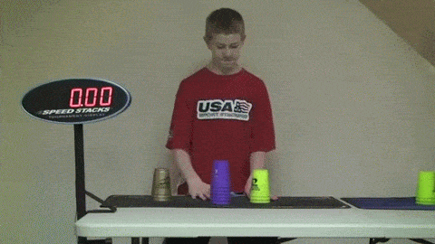
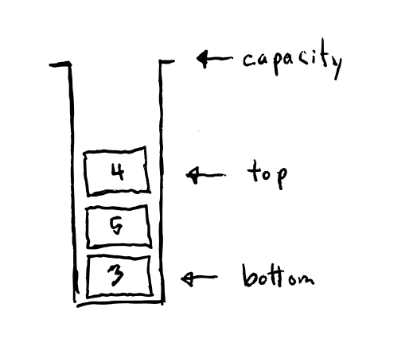
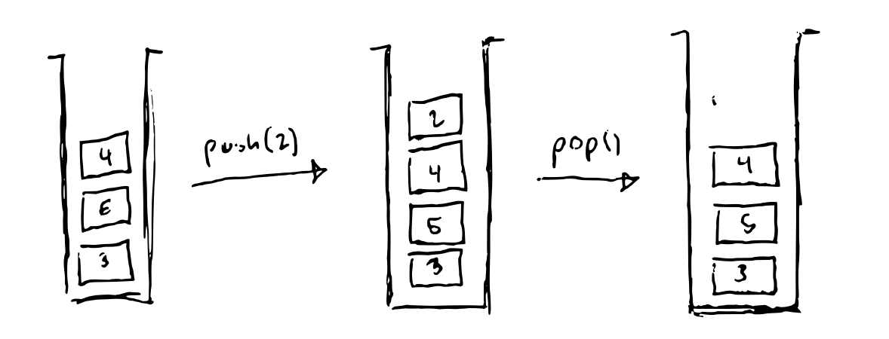
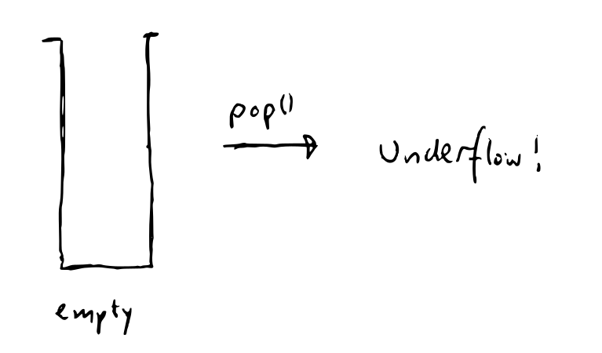
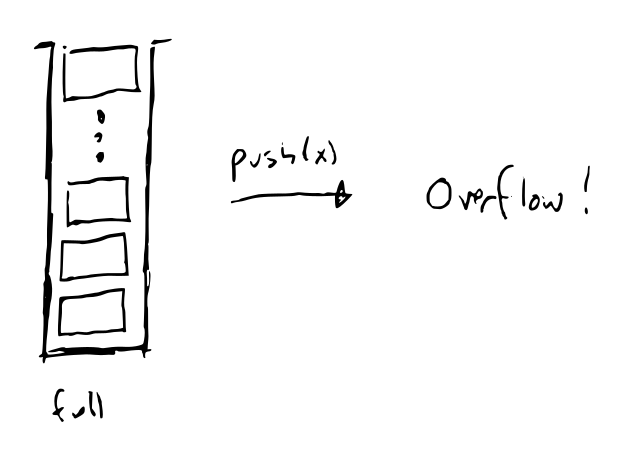
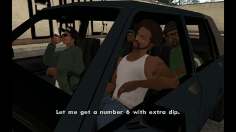

# 🥞 Stacks

## 🎯 Objectives

- **Explain** the stack data structure.
- **Design** a stack data structure.
- **Solve** a problem using a stack.
- **Implement** a stack data structure in Java.

## ↪️ Last in, First out

A stack is a *collection* of data. We refer to individual data items in the collection as *elements*.

A stack is a **LIFO** collection: the *last* element added to the stack is the *first* element to leave.

Let's draw a stack like this:

- **bottom:** the element at the "lowest" possible position in the stack.
- **empty:** where there are no elements in the stack.
- **top:** the element at the "highest" possible position in the stack.
- **capacity:** the maximum number of elements in the stack.

## 📐 Stack Design

For every operation we design we will consider:

1. A description of what the operation accomplishes.
2. What the operation is called, what are it's inputs and outputs. This is called the *signature*.
3. What are the operation's *preconditions*, that is, what condition is required to be met in order to call the method.
4. What are the operation's *postconditions*, that is, what are the expected changes  the object when the operation is called.

### ▶️ Exercise 3.1 - Stack Design

Let's start by designing a stack that holds `int` values, only for now.

A *push* operation adds an element to the top of the stack.

A *pop* operation removes an element from the top of the stack.

|                                                                        |                                                                       |
| ---------------------------------------------------------------------- | --------------------------------------------------------------------- |
|  |  |

| `push()`     |                                         |
| ------------ | --------------------------------------- |
| Description  | Add an element to the top of the stack. |
| Signature    | `void push(int element)`                |
| Precondition | Stack is not full.                      |
| Mutator      | Yes.                                    |
| Returns      | -                                       |

Can return `boolean` but what happens when we implement `pop()`?

| `pop()`      |                                                |
| ------------ | ---------------------------------------------- |
| Description  | Remove an element from the stack.              |
| Signature    |                                                |
| Precondition | Stack is not empty.                            |
| Mutator      | Yes.                                           |
| Returns      | The element removed from the top of the stack. |

| `top()`      |                                   |
| ------------ | --------------------------------- |
| Description  | Get the top element of the stack. |
| Signature    |                                   |
| Precondition | Stack is not empty.               |
| Mutator      | No.                               |
| Returns      | The top element is returned.      |

| `isEmpty()`  |                                                  |
| ------------ | ------------------------------------------------ |
| Description  | Check if the stack is empty.                     |
| Signature    |                                                  |
| Precondition | None.                                            |
| Mutator      | No.                                              |
| Returns      | `true` if the stack is empty, `false` otherwise. |

| `isFull()`   |                                                 |
| ------------ | ----------------------------------------------- |
| Description  | Check if the stack is full.                     |
| Signature    |                                                 |
| Precondition | None.                                           |
| Mutator      | No.                                             |
| Returns      | `true` if the stack is full, `false` otherwise. |

!> "Stack exists" precondition: the existence of the object is required for all operations so we will omit it as a precondition. It will be considered incorrect on test.

- Alternate design: `size()` and `getCapacity()`.

## 🍔 APIs

You've probably heard the term "API" get thrown around in computer science. What does it mean exactly?

One analogy could be ordering from a menu:

The restaurant's menu is like its API. The menu is there to tell you what you're allowed to order at the restaurant. You can **only** order things that are listed on the menu, and **nothing else**.

API = [Application Programming Interface](https://en.wikipedia.org/wiki/API)

?> In contrast to a user interface, which connects a computer to a person, an application programming interface connects computers or pieces of software to each other.

It's in the name - **interface**! Recall that in OOP, an interface acts as a contract. The implementing class **must** override all methods included in the interface. Because of this contract-like behaviour, it means that any code (i.e. customer) that needs to use the implementing class (i.e. restaurant) knows what methods it will have due to the interface (i.e. menu).

### ▶️ Exercise 3.2 - Paired Brackets

Using just the Stack API, (pseudo) code a method `hasPairedBrackets` that uses a stack to determine if brackets `( )`, `{ }`, `[ ]` and `< >` are properly *paired*: each opened bracket is closed but only after subsequent opened brackets are closed.

Good: `()`, `([])`, `<>`, `((()))`, etc.
Bad: `(`, `(]`, `{[}]`, `<<>`, `<>>`, etc.

If we ignore non-bracket characters, these would also be accepted:

Good: `<html>`, `(a[bc]?)`, `(you (should learn (lisp)))`, etc.

### ▶️ Exercise 3.3 - Stack Implementation

Please click [here](https://github.com/JAC-CS-Programming-4-W23/E3.3-Stacks) to do the exercise.

## 📚 References

- [Application Programming Interface](https://en.wikipedia.org/wiki/API)
