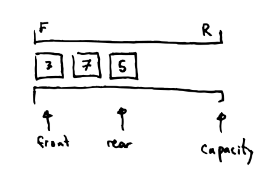
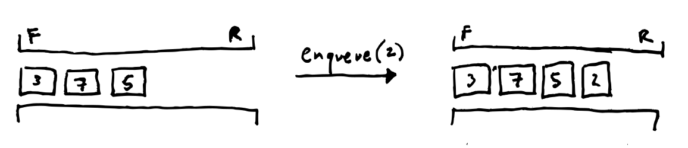
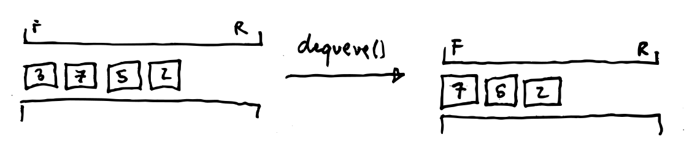
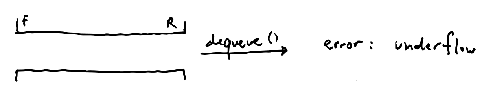
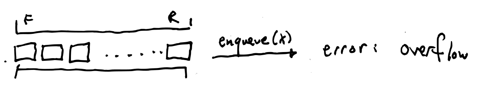

# 🚏 Queues

## 🎯 Objectives

- **Explain** the queue data structure.
- **Design** a queue data structure.
- **Solve** a problem using a queue.
- **Implement** a queue data structure in Java.

## ↪️ First in, First out

A queue is a *collection* of data, just like a stack, only with a different set of rules. And like a stack, we refer to individual data items in the collection as *elements*.

A queue is a **FIFO** collection: the *first* element added to the queue is the *first* element to leave.

?> Recall that a *stack* is **LIFO**: last in, first out. Imagine a world where all our line-ups were LIFO instead of FIFO!

Let's draw a queue like this:

- **front:** the element at the first position in the queue.
- **rear:** the element in the last position in the queue.
- **empty:** where there are no elements in the queue.
- **capacity:** the maximum number of elements in the queue.

## 📐 Queue Design

For every operation we design we will consider:

1. A description of what the operation accomplishes.
2. What the operation is called, what are it's inputs and outputs. This is called the *signature*.
3. What are the operation's *preconditions*, that is, what condition is required to be met in order to call the method.
4. What are the operation's *postconditions*, that is, what are the expected changes  the object when the operation is called.

### ▶️ Exercise 4.1 - Queue Design

Again, lets only consider a collection `int` for now to keep it simple.

A *enqueue* operation adds an element to the rear of the queue.

A *dequeue* operation removes an element from the front of the queue.

What is a possible problem: queue *underflow*.

What is a possible problem: queue *overflow*.

| `enqueue()`  |                                          |
| ------------ | ---------------------------------------- |
| Description  | Add an element to the rear of the queue. |
| Signature    | `void enqueue(int element)`              |
| Precondition | queue is not full.                       |
| Mutator      | Yes                                      |
| Returns      | `element` is the new rear of queue.      |

| `dequeue()`  |                                        |
| ------------ | -------------------------------------- |
| Description  | Remove an element from the queue.      |
| Signature    | `int dequeue()`                        |
| Precondition | queue is not empty.                    |
| Mutator      | Yes                                    |
| Returns      | the element is removed from the queue. |

| `front()`    |                                                           |
| ------------ | --------------------------------------------------------- |
| Description  | Get the front element of the queue.                       |
| Signature    | `int front()`                                             |
| Precondition | Queue is not empty.                                       |
| Mutator      | No                                                        |
| Returns      | The front element is returned and the queue is unchanged. |

| `isEmpty()`  |                                                                                  |
| ------------ | -------------------------------------------------------------------------------- |
| Description  | Check if the queue is empty.                                                     |
| Signature    | `boolean isEmpty()`                                                              |
| Precondition | None.                                                                            |
| Mutator      | No                                                                               |
| Returns      | Returns `true` if the queue is empty, `false` otherwise. The queue is unchanged. |

| `isFull()`   |                                                                                 |
| ------------ | ------------------------------------------------------------------------------- |
| Description  | Check if the queue is full.                                                     |
| Signature    | `boolean isFull()`                                                              |
| Precondition | None.                                                                           |
| Mutator      | No                                                                              |
| Returns      | Returns `true` if the queue is full, `false` otherwise. The queue is unchanged. |

!> "Queue exists" precondition: the existence of the object is required for all operations so we will omit it as a precondition. It will be considered incorrect on test.

### ▶️ Exercise 4.2 - Queue Implementation

Please click [here](https://github.com/JAC-CS-Programming-4-W23/E4.2-Queue-Array) to do the exercise.

## 📚 References

- [Application Programming Interface](https://en.wikipedia.org/wiki/API)
