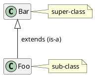
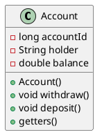
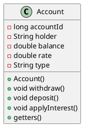
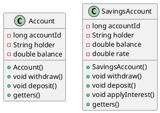
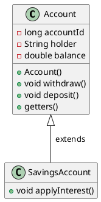
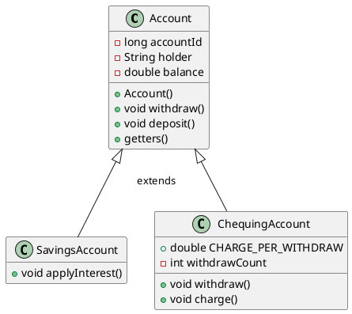
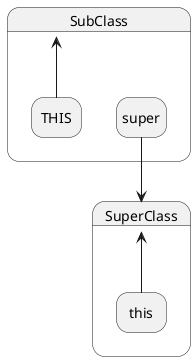

# 👩‍👧 Inheritance

## 🎯 Objectives

- **Explain** inheritance.

## 👖 Jeans & Genes

[](https://www.medicowesome.com/2016/09/inheritance-funny-illustration.html)

When a class is built on top of another class. Specifically it "inherits" the original class' members (fields, constructors, methods, etc.). Described as an "is-a" relationship, but Java uses the keyword "extends":



We call the original class the _super_ class and the new, inheriting class, the _sub_ class.

How is this useful? There are a few uses, for now we can focus on code reusability: the sub-class does not repeat the members of the super-class.

## #️⃣ Method Types

When dealing with inheritance, there are generally 3 kinds of methods:

1. Methods that are **only** members of the **superclass**.
2. Methods that are **only** members of the **subclass**.
3. Methods that are members of the superclass that are **redefined** in the subclass, called a _method override_. Java uses the method signatures to figure out the override. The method name and the parameters (datatypes) must match. The `@Override` annotation is optional, but very helpful. There are two kinds of overrides:
   1. Overrides that completely replace the superclass version.
   2. Overrides that makes use of the superclass version. These will call the super-class version using the `super` keyword.

Here's an example of how these methods are accessed:

```java
public class Animal {
    public void eat() {
        System.out.println("Munch crunch");
    }

    public void speak() {
        System.out.println("Words!");
    }

    public void sleep() {
        System.out.println("Zzz");
    }
}

public class Dog extends Animal {
    @Override
    public void speak() {
        System.out.println("Woof!");
    }

    @Override
    public void sleep() {
        System.out.println("Spin around");
        super.sleep();
    }

    public boolean isNoseWet() {
        return true;
    }
}
```

When we instantiate these classes and call each method we get the this:

```java
Animal animal = new Animal();
Dog dog = new Dog();

animal.eat();       // -> Munch crunch
animal.isNoseWet(); // -> Compiler error, no such method
animal.speak();     // -> Words!
animal.sleep();     // -> Zzz

dog.eat();   // -> Munch crunch
dog.speak(); // -> Woof!
dog.sleep(); // -> Spin around -> Zzz
```

## ▶️ Exercises

### Bank Accounts



?> This notation is known as [Unified Modeling Language (UML)](https://www.visual-paradigm.com/guide/uml-unified-modeling-language/what-is-uml/#uml-overview) and is the standard way to draw various types of software architecture diagrams.

#### Basic Account

What would you need to store an account? Probably things like an account number, balance, SIN (or other personal info), name, phone, type (!), etc.

What operations would you support? Withdrawals, deposits, check balance, etc.

```java
public class Account {
    private long accountId;
    private String holder;
    private double balance;

    public Account(long accountId, String holder, double balance) {
        this.accountId = accountId;
        this.holder = holder;
        this.balance = balance;
    }

    public void withdraw(double amount) {
        if (amount < 0 || amount > balance) {
            throw new IllegalArgumentException();
        }

        balance -= amount;
    }

    public void deposit(double amount) {
        if (amount < 0) {
            throw new IllegalArgumentException();
        }

        balance += amount;
    }

    /* ...Getters... */
}
```

Here's an example of how we can create an account:

```java
Account account = new Account(123L, "Anakin", 100.0);

account.deposit(1000.0);
account.withdraw(50.0);

System.out.println(account.getBalance());
```

#### Savings Account (Bad)

We need a way to accrue interest on our account. Usually this is done through a savings account. One way to do this could be to add `type` and `rate` fields, and an `applyInterest()` method on our `Account` class:



```java
public class Account {
    /* ... */

    private double rate;
    private String type;

    public Account(long accountId, String holder, double balance, double rate, String type) {
        /* ... */

        this.rate = rate;
        this.type = type;
    }

    public void applyInterest() {
        if (type == "savings") {
            balance += balance * rate;
        }
    }

    /* ... */
}
```

This is bad for several reasons:

1. We now have fields that are not relevant to all accounts.
2. The number of constructor parameters has grown.
3. We have to do a check on a flimsy `type` string inside of `applyInterest()` to make sure we only apply the interest if it's the right type of account.

#### Savings Account (Better)

One solution to the above mentioned problems would be to make a separate class for our savings account:



```java
public class Account {
    /* ... */
}

public class SavingsAccount {
    private long accountId;
    private String holder;
    private double balance;
    private double rate;

    public SavingsAccount(long accountId, String holder, double balance, double rate) {
        this.accountId = accountId;
        this.holder = holder;
        this.balance = balance;
        this.rate = rate;
    }

    public void withdraw(double amount) {
        if (amount < 0 || amount > balance) {
            throw new IllegalArgumentException();
        }

        balance -= amount;
    }

    public void deposit(double amount) {
        if (amount < 0) {
            throw new IllegalArgumentException();
        }

        balance += amount;
    }

    public void applyInterest() {
        balance += balance * rate;
    }

    /* ... */
}
```

This is better because now all savings functionality is contained within the `SavingsAccount` class and our regular `Account` class can function as normal. However, the **huge** problem here is (and I hope you saw it before reading it here) the absolutely **massive** amount of **duplicated code**!

#### Savings Account (Best)

Let's leverage the code that already exists in `Account` by having our `SavingsAccount` _inherit_ the `Account` class:



```java
public class SavingsAccount extends Account {
    private double rate;

    public SavingsAccount(long accountId, String holder, double balance, double rate) {
        super(accountId, holder, balance);

        this.rate = rate;
    }

    public void applyInterest() {
        deposit(getBalance() * rate);
    }
}
```

Here's the example of how we can create a savings account:

```java
SavingsAccount savingsAccount = new SavingsAccount(124L, "Obi-Wan", 100.0, 0.02);

savingsAccount.deposit(1000.0);
savingsAccount.withdraw(50.0);
savingsAccount.applyInterest();

System.out.println(savingsAccount.getBalance());
```

1. We use the keyword `extends` to indicate the super-class.
2. We need to write a constructor that initializes the super-class members, i.e.: calls the super-class constructors. This usually, though not always, means that we need to write a sub-class constructor that includes the parameters of the super-class constructor. We call the super-class constructor from the sub-class constructor using the `super(..)` call.
3. Super-class members are available in the sub-class and to the other parts of the program.
4. Private super-class members are private to the sub-class. They are still part of the sub-class, since they form the overall object but they are hidden or invisible to the sub-class code.

#### Chequing Account

Let's extend our basic `Account` with the idea that transactions (withdrawals only) can be charged. There is now an withdrawal counter and an operation `charge()`. We will inherit the `Account` class members and add this new feature:



```java
public class ChequingAccount extends Account {
    public static final double CHARGE_PER_WITHDRAW = 0.25;
    private int withdrawCount;

    public ChequingAccount(long accountId, String holder, double balance) {
        super(accountId, holder, balance);
        withdrawCount = 0;  // Unnecessary since integers default to 0.
    }

    @Override
    public void withdraw(double amount) {
        super.withdraw(amount);
        withdrawCount++;
    }

    public void charge() {
        withdraw(withdrawCount * CHARGE_PER_WITHDRAW);
        withdrawCount = 0;
    }
}
```

Here's the example of how we can create a chequing account:

```java
ChequingAccount chequingAccount = new ChequingAccount(125L, "Yoda", 100.0);

chequingAccount.deposit(1000.0);
chequingAccount.withdraw(50.0);
chequingAccount.withdraw(100.0);
chequingAccount.charge();

System.out.println(chequingAccount.getBalance());
```

Notice:

1. We can redefine a method, called a _method override_.
2. The original super-class method is still called when the object is the super-class, and the new version is called with the object is the sub-class.
3. Inside the sub-class, you can still make use of the super-class method by using the `super` keyword.



### Extending the Stack

Create a class called `StackMany` that supports the original stack operations with two new ones:

<!-- tabs:start -->

#### **pushMany**

| Signature    | `void pushMany(T[] elements)`                        |
| ------------ | ---------------------------------------------------- |
| Description  | Push multiple elements onto the stack in LIFO order. |
| Precondition | Stack has room for the number of elements.           |
| Mutator      | Yes.                                                 |
| Returns      | None.                                                |

#### **popMany**

| Signature    | `T[] popMany(int amount)`                           |
| ------------ | --------------------------------------------------- |
| Description  | Pop multiple elements from the stack in LIFO order. |
| Precondition | Stack has the number of elements, `amount > 0`.     |
| Mutator      | Yes.                                                |
| Returns      | The popped elements in LIFO order.                  |

<!-- tabs:end -->

### Extending the Queue

Create a class `QueueDefault` that supports the original queue operations with the following update: dequeue will either return an enqueued value, or if there are none, will return the default value. The queue never appears as empty.

### Refactoring the Survey

Refactor the survey app we made in the first week of the semester using inheritance instead of interfaces. Replace the `Questionable` interface with a `Question` superclass.

Advice:

- Look to see what's common among the current questions' methods and what is done differently in each.
- Store as much info as you can in the `Question` class.
- Think about what behaviours will be overridden by more complicated question styles.
- There are two solutions here: one that will include an `abstract` method in your design and one that doesn't. Either are good!
