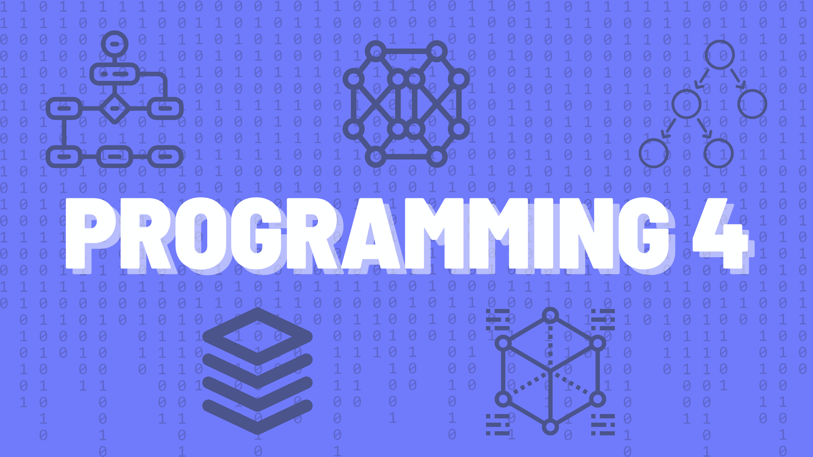

# 420-4P6 Programming 4

In this repo you will find the notes for this course.

You can view the pretty version of the notes 
[here](https://jac-cs-programming-4-w23.github.io/Notes).

## ✒️ Course Description

Welcome to Programming 4! We are really excited to teach and learn the fundamentals of data structure and algorithms 
with you. One of the major differences between novice and expert programmers is their knowledge and 
usage of well-known data structures and algorithms in the programs they write. Knowing the 
trade-offs between the time certain algorithms take and how much space certain data structures use 
can make a huge difference in the performance of your programs. It can be as significant as your 
program taking minutes to run versus seconds!

In this course, you will build on all the knowledge of programming you've gained so far in the 
Computer Science program. Basic data structures, lists, maps and sets, will be studied. You will 
gain a deeper understanding of how object-oriented solutions are designed and implemented, 
specifically _when_ and _how_ specific programming techniques are useful. These topics include 
**generics**, **inheritance and polymorphism**, **recursion**, 
**lambda expressions** and **higher-order functions**, as well as simple 
**software design patterns**. 

You will use object-oriented programming to model a database environment and produce a software 
library. The programming language will be [Python](https://docs.python.org/3.11/).

# Copyright Notice

All notes in this package are copyrighted under the Creative Commons License CC BY-NC

This license enables reusers to distribute, remix, adapt, and build upon 
the material in any medium or format for noncommercial purposes only, and only 
so long as attribution is given to the creator. 

CC BY-NC includes the following elements:

 BY: credit must be given to the creator.
 NC: Only noncommercial uses of the work are permitted.

Notes originated from Ian Clement, and modified by Vikram Singh.  
They have been subsequently modified by Ian Clement and Sandy Bultena.

All rights reserved (c) 2024

